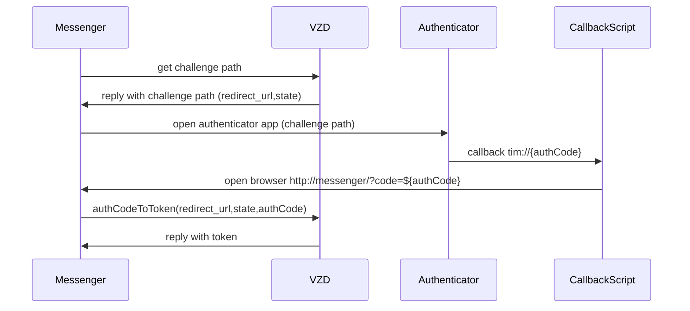
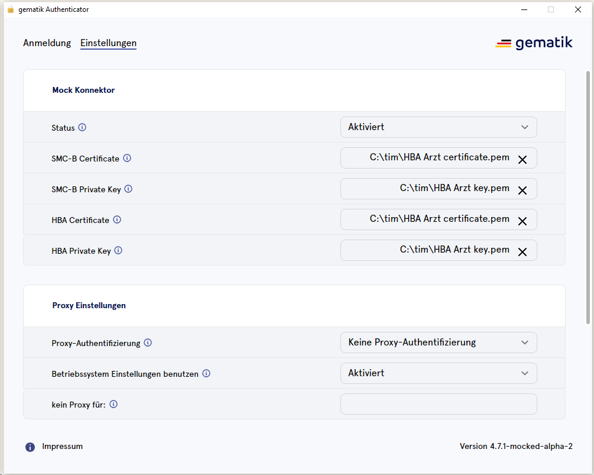

Authentication for HBA operations
=================================

To communicate with the VZD an access token is required.
These are provided by the _Gematik Authenticator_. The Authenticator is a native Windows application.
To execute the Authenticator, a so-called _Challenge path_ is necessary. This needs to be acquired from the VZD via a REST call.

The following flow works under Windows only via the web variant of the messenger:


# Required Windows Installation
* The Web variant of the Messenger needs to be present and accessible (VPN).  
* So far this was only tested on Chrome.
* A number of scripts need to be installed. (look [here](#usage-under-windows))

# Communication with the VZD

For the fetching of the _challenge path_ an HTTP GET call is required. The VZD responds in this case with a _Status 302_ and a _Location Header_. 
This response code inadvertently leads to a redirect in the browser and doesn't permit the response body to be processed programmatically nor to extract the location header.
Thus, a _Reverse Proxy_ was configured which is called instead of the VZD. This proxy returns an HTTP response with the _Status 200_ and the VZD response as a JSON payload. 

* [Nginx Configuration](./nginx/nginx.conf)
* [Proxy Script](./nginx/vzd-redirect-transformer.js). (Included via `nginx.conf`.)

For the local testing of the configuration, the script `./run.sh test_proxy` can be used (local Docker installation is required).

# Usage under Windows

For the HBA authorization flow to work under Windows 10, the following steps are required: 

## Authenticator Installation and Configuration

1) Download the following highlighted files from "gematik Authenticator" in the download section from https://fachportal.gematik.de/hersteller-anbieter/komponenten-dienste/authenticator:
     - Mockvariante Alpha-Version (TEST-ONLY)
       - Mock-Modus Zertifikate
         - **HBA Arzt certificate.pem**
         - **HBA Arzt key.pem**
       - **gematik Authenticator Setup - Mock Version 4.7.1-mocked-alpha-2.exe** 

2) Run the installer (.exe from step 1)
      
3) Reference practitioner certificates in authenticator, see   

```
Note: the authenticator can work correctly even if some of the functionality tests do no pass, e.g.

- "Erreichbarkeit des zentralen IDP RU TI"
- "Erreichbarkeit des zentralen IDP PU TI"
```

## Callback Handler Installation and Registration
- Copy files from messenger-client/hba-win-flow (tim.bat, tim.ps1, timUrlProgram.reg) to `c:/tim`.
- Within the Powershell with administrator rights, run the commands: 
  - `Set-ExecutionPolicy unrestricted`
  - `Unblock-File -Path C:\tim\tim.ps1`
- Run the script `timUrlProgram.reg` via double-click. This creates a registry entry and links the URL schema _tim://_ with the _.bat_ command from the first step.
