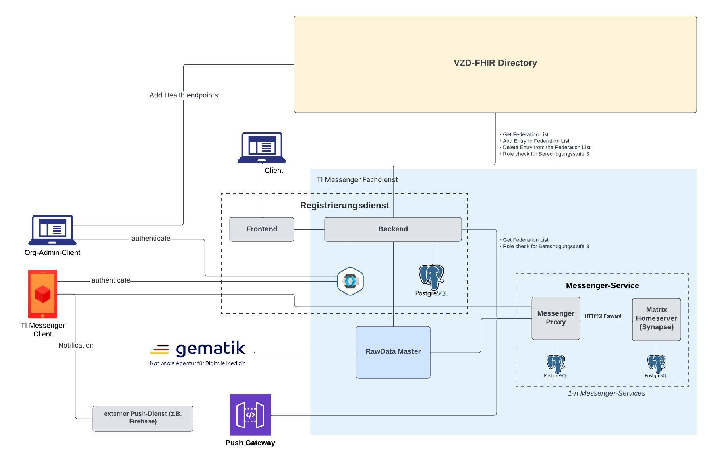

# TIM Referenzimplementierung - Messenger Client

This project contains the `TIM reference implementation` of a `Messenger Client` instance. It is based on the following technologies:
* Flutter 
* Dart

This Messenger Client of the TIM reference implementation (“Messenger Client”) is licensed under version 3 of the GNU Affero General Public License and other licenses. The implementation is based on FluffyChat (https://github.com/krille-chan/fluffychat) and on the Matrix DART SDK (https://github.com/famedly/matrix-dart-sdk) by Famedly GmbH.

You may convey this Messenger Client under the terms of the version 3 of the GNU Affero General Public License, available from the URL https://github.com/tim-ref/messenger-client/blob/main/LICENSE.
This Messenger Client is distributed in the hope that it will be useful, but WITHOUT ANY WARRANTY; without even the implied warranty of MERCHANTABILITY or FITNESS FOR A PARTICULAR PURPOSE. See the GNU Affero General Public License for more details.

Further third-party libraries and the underlying license information are available from the URL https://github.com/tim-ref/messenger-client-dependencies.

Original fork: https://github.com/krille-chan/fluffychat

License: https://github.com/tim-ref/messenger-client/blob/main/LICENSE

Source code repository: https://github.com/tim-ref/messenger-client

Source code: https://github.com/tim-ref/messenger-client/tags

Third-party libraries repository: https://github.com/tim-ref/messenger-client-dependencies

Third-party libraries: https://github.com/tim-ref/messenger-client-dependencies/tags

Noto Emoji: https://github.com/googlefonts/noto-emoji/

Imprint: https://akquinet.com/impressum.html

## Quickstart: Webclient with Docker 

- make sure docker is installed and docker deamon is running
- build image and start container
  - `docker build . -t "timref_web" && docker run -p 8989:80 timref_web`
  - alternatively you can use docker-compose `docker-compose up`

this will build the web client and start a server on

http://localhost:8989/


## Requirements

> <span style="color:orange;">IMPORTANT:</span> Choose flutter sdk version **3.24.X** - newer versions are not supported!

* Flutter **3.24** (tested: 3.24.4, Dart 3.5.4)
    * download SDK:
        * [for Windows](https://docs.flutter.dev/release/archive?tab=windows)
        * [for Linux](https://docs.flutter.dev/release/archive?tab=linux)
        * [for MacOS](https://docs.flutter.dev/release/archive?tab=macos)
    * see [general installation instructions](https://docs.flutter.dev/get-started/install)
    * consider using [Flutter Version Manager](https://fvm.app/docs/guides/basic_commands/)
* for Android
    * Android Studio
* for iOS
    * Xcode
    * CocoaPods
* not necessary but recommended
    * [SdkMan!](https://sdkman.io/) to switch between different java versions.
    * [brew](https://brew.sh) or similar to install some of the dependencies
    * [Android Studio](https://developer.android.com/studio) as standard tooling for Android-/Flutter development

## Usage

To run the web client the following are required (see [Requirements](#requirements) for helpful links).

* Flutter (version see above)
* Browser: Current version of Google Chrome is the recommended browser. Firefox, Safari and Microsoft Edge are supported by flutter as well but are not 
as thoroughly tested as Google Chrome.


After running:

```shell
$ ./run.sh web
```

the web client can be accessed under http://0.0.0.0:8989.


## Development

### Installation

1. run `flutter doctor` afterwards and also after each of the following steps, it will tell you what is missing
    ```shell
    $ flutter doctor
    ```
2. install Android Studio
    * if `flutter doctor` could not locate the JRE within the Android installation: https://stackoverflow.com/a/75134478
        * Install the flutter plugin. This will also install the dart plugin.
3. if you have IntelliJ installed
    * you can use IntelliJ to import this project. When opening the project IntelliJ will install additional plugins (
      restart required)
    * it will install the flutter plugin plus the dart plugin. you will need to configure the path to the dart sdk (this
      was installed in a previous step)
    * you may also need to configure the path to the android sdk in the android plugin
4. install Android toolchain
    * check that _sdkmanager_ is available: `~/Library/Android/sdk/tools/bin/sdkmanager --version`
    * install tools: `~/Library/Android/sdk/tools/bin/sdkmanager --install "cmdline-tools;latest"`
    * apparently this installer requires java. I had to ensure to use the correct java version as i would otherwise get
      this exception: `java.lang.NoClassDefFoundError: javax/xml/bind/annotation/XmlSchema`
      i have used java 8 for the _install tools_ step: e.g. `sdk use java 8.0.362-zulu`.
    * to accept the licenses i needed to use java 11:
        * e.g. `sdk use java 11.0.18-zulu`
        * `flutter doctor --android-licenses`
5. Flutter can default to using Android Studio's JBR instead of the JDK at $JAVA_HOME. If this is the case,
   switching SDKs with SdkMan has no effect, and updating Android Studio can break your Android build.
   You can diagnose this misconfiguration by running `flutter doctor -v`. If it yields something like
   "Java binary at: /Users/username/Applications/Android Studio.app/Contents/jbr/Contents/Home/bin/java",
   you're using the JBR.
   You can switch to the current system JDK like this:
   ```shell
   flutter config --jdk-dir $JAVA_HOME
   ```

### Code generation

#### Serialization

Serialization is handled via [json_serializable](https://pub.dev/packages/json_serializable).
After editing models with the annotation "@JsonSerializable", run the following command in the package directory:
```shell 
dart run build_runner build --delete-conflicting-outputs
```

The generated code can be found in the referenced `*.g.dart` files.

#### OpenApi Code generation

This Flutter project utilizes the [openapi-generator](https://pub.dev/packages/openapi_generator) package to generate 
API client code and the necessary data models from an OpenAPI specification.

##### Conventions

A custom generator class has been added to manage the code generation process. You can find it under the 
[lib/feature/example_feature](lib/tim/feature/contact_approval/contact_open_api_generator.dart) folder. 
This class is annotated with [openapi_generator_annotations](https://pub.dev/packages/openapi_generator_annotations) 
for configuration.

The OpenAPI specification file is located in the 
[openapi/example_api_name/spec](openapi/tim_contact_management_api/spec) folder.

##### Generate the code

Run the following command to (re)generate the API client and models:

```shell 
dart run build_runner build
```

The generated files should be located to the [openapi/example_api_name](openapi/tim_contact_management_api) folder. 

##### Using the Generated Code

To integrate the generated API client into the project:

Add the generated code as a dependency in your pubspec.yaml:
```yaml
  dependencies:
    example_api_name:
      path: openapi/example_api_name
```
Import the necessary classes and use the client as required in your implementation.

### Build (Android)

* insert your own `google-services.json`-file into `android/app/` for the push notifications to work
* build the debug apk (for usage by the
  _messenger-testtreiber-api_): `flutter build apk --debug`
    * the _.apk_ will be available in `build/app/outputs/flutter-apk/app-debug.apk`

#### Build parameters

* **How to build for TestDriver application**

  Add `--dart-define=ENABLE_TEST_DRIVER=true --dart-define=ENABLE_DEBUG_WIDGET=true` to your build command.


* **How to add visible DebugWidget**

  Add `--dart-define=ENABLE_DEBUG_WIDGET=true --dart-define=DEBUG_WIDGET_VISIBLE=true` to your build command.

#### Run with working FHIR client

The build-in FHIR client requires additional configuration. Run it like this:

```shell
fvm flutter run \
    --dart-define=TOKEN_DISPENSER_URL="${TOKEN_DISPENSER_URL}" \
    --dart-define=TOKEN_DISPENSER_USER="${eu-token-dispenser-1-credentials--username}" \
    --dart-define=TOKEN_DISPENSER_PASSWORD="${eu-token-dispenser-1-credentials--password}"
```

You need to insert the missing configuration/secrets.

### Unit Testing

To run all test cases in this repository use
```shell
$ flutter test --dart-define=TOKEN_DISPENSER_URL=https://timref-auth.eu.timref.akquinet.nx2.dev:8448/2/dispenseToken
```

### Code style & quality

Please use `dart format` to properly format your code and `flutter analyze` scan for issues. You should do this before every commit:

```shell
dart format lib/tim test/tim
flutter analyze lib/tim test/tim
```

## Dependencies

Immediate dependencies are listed in [pubspec.yaml](pubspec.yaml) and [pubspec.lock](pubspec.lock). 
You can use the command `flutter pub deps` to print all dependencies. 
Use `flutter pub deps --no-dev` instead to print runtime dependencies only, excluding development tooling.

## License Reports

A license report can be created by activating and using the dart license checker. Go to the directory 
that contains the wanted pubspec.yaml (e.g. the project directory in this case) and run:
```shell
$ dart pub global activate dart_license_checker
$ dart_license_checker
```
This gives you all immediate dependencies, but there is a flag to get all transitive dependencies instead:
```shell
$ dart_license_checker --show-transitive-dependencies
```
Some licenses are returned as _unknown_, because they are not correctly displayed by https://pub.dev/.
Therefore we added a list of [licenses](documentation/licenses/package_licenses.txt) and of all [transitive dependencies](documentation/licenses/package_licences_transitive_dependencies.txt) as text files.

### To add Translations
Refer to [this guide](README-translation-guide.md).

### HBA Authentication
Further information about the usage of the HBA authentication is listed [here](README-hba-auth.md).

## Architecture Overview

### Ways of communication
1. Connection to the homeserver (Synapse) via Messenger Proxy
2. Connection to Keycloak for authentication
3. Connection to the VZD in order to change visibility
4. Connection to Push Gateway for receiving Push Notifications


